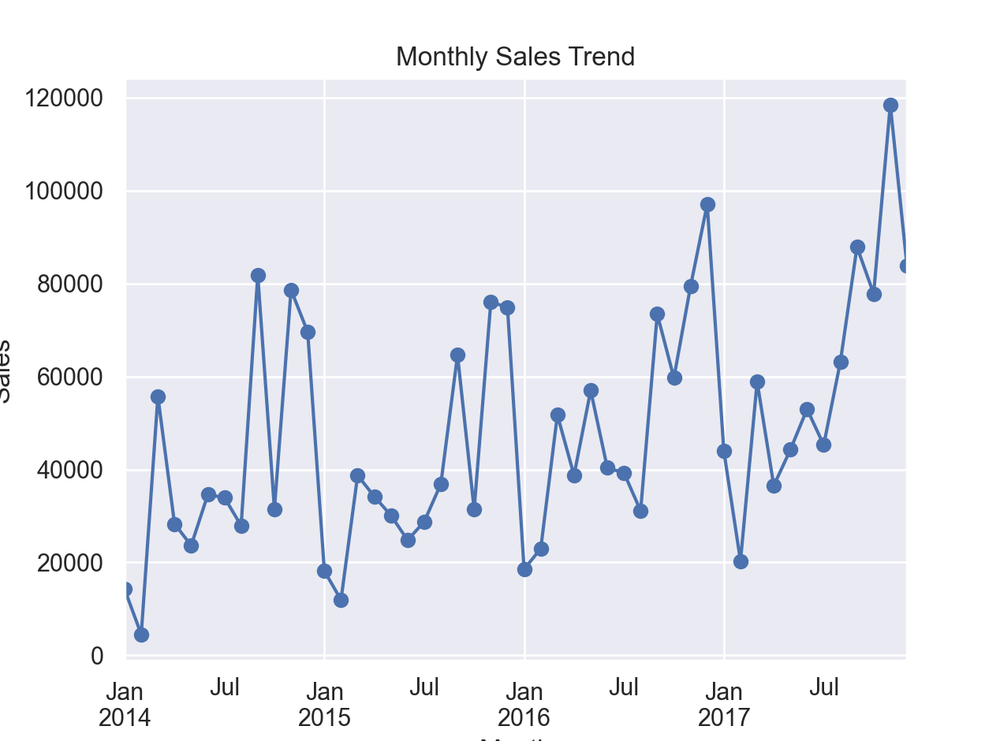
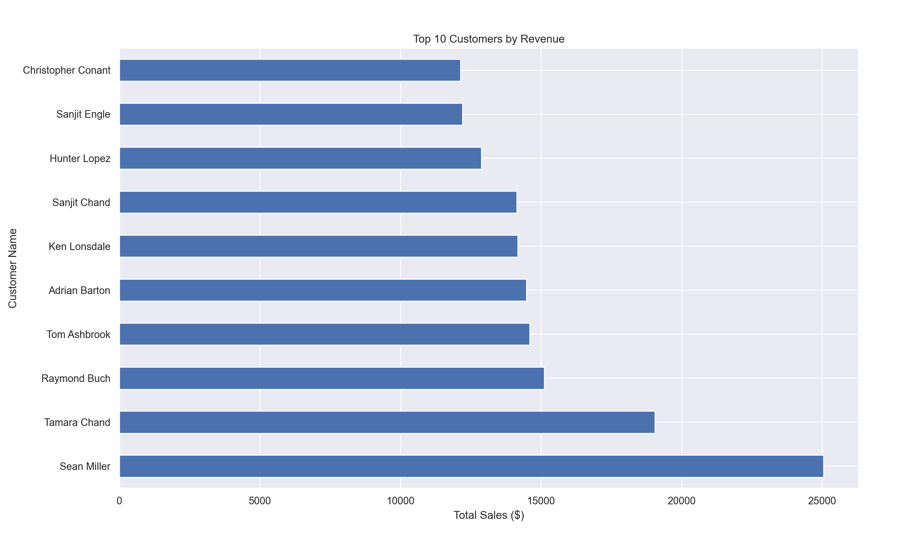
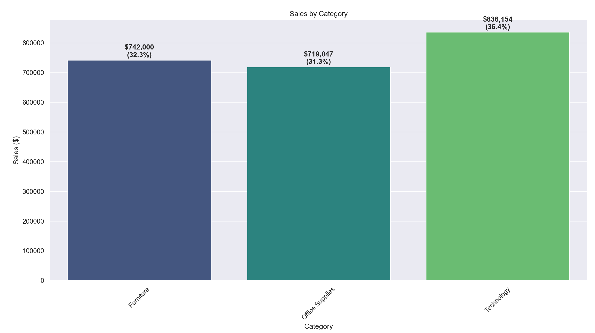
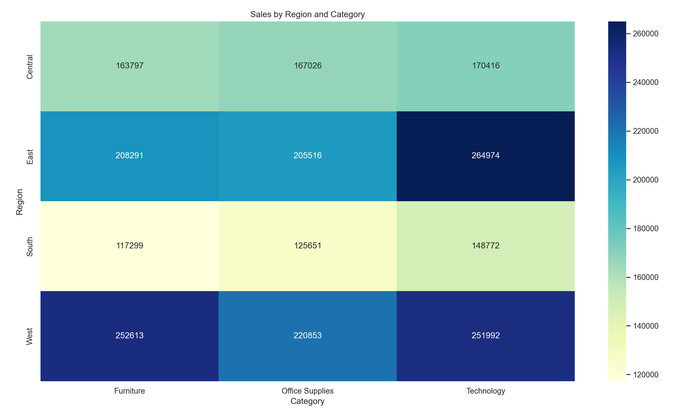

# Customer Sales Analysis (Python)

This project analyzes a retail sales dataset to uncover key insights on customer behavior, product performance, and regional trends using Python libraries like `pandas`, `matplotlib`, and `seaborn`.

## Key Insights

- Sales show seasonal trends with strong Q4 performance.
- Technology is the highest-grossing category.
- The East and West regions lead in sales volume.
- Top 10 customers account for a significant revenue share.

## Dataset

Dataset sourced from Kaggle:  
[Superstore Sales Dataset](https://www.kaggle.com/datasets/vivek468/superstore-dataset-final)

## Technologies Used

- Python 3
- pandas
- matplotlib
- seaborn

## How to Run

1. Clone the repo
2. Install dependencies:  
   `pip install -r requirements.txt`
3. Run the analysis script or open the notebook

## Sample Visualizations

### Monthly Sales Trend

### Top 10 Customers by Revenue

### Sales by Category

### Regional Category Sales (Heatmap)

